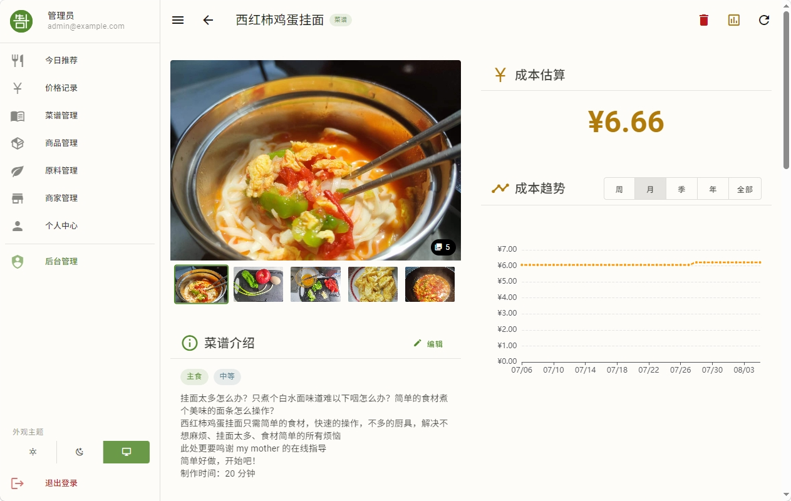

# 生计 - 生活成本计算器

> 记录商品价格，计算烹饪成本与营养，优化生活开支。

自己做饭，总是希望尽可能省钱，还能吃好。因此，该项目应运而生。

它目前的功能：

- 维护原料及对应的商品、菜谱，以及商家信息。
- **记录商品价格**：在超市等商家记录价格，或是记录自己购买的食材。可以查看各食材、商品的价格趋势。
- **计算烹饪成本与营养**：自动计算、展示各菜谱的成本及其趋势，以及营养信息。
- **优化生活开支**：除了通过上述功能辅助决策外，还会推荐每日菜谱（虽然还不太完善）

目前支持 Web 端，数据库支持 SQLite、MySQL、PostgreSQL，此外还支持本地模式（数据存在用户的浏览器上）。图片存储支持服务端存储和 S3 兼容对象存储。

移动 APP 正在开发。不过 Web 端适配移动平台，而且支持 PWA，可将网页添加到主页方便使用。

## 文档

完整文档在 [docs/](docs/)，建议从下面任一篇开始：

- **第一次用** → [入门](docs/getting-started.md)
- **想搞懂系统怎么算账** → [核心概念与计算逻辑](docs/concepts.md)
- **普通用户功能** → [文档首页](docs/README.md)
- **管理员 / 自部署** → [后台管理与运维](docs/admin/)

## 致谢

- 菜谱参考：[HowToCook](https://github.com/Anduin2017/HowToCook)
- 营养数据：[USDA FoodData Central](https://fdc.nal.usda.gov/)
