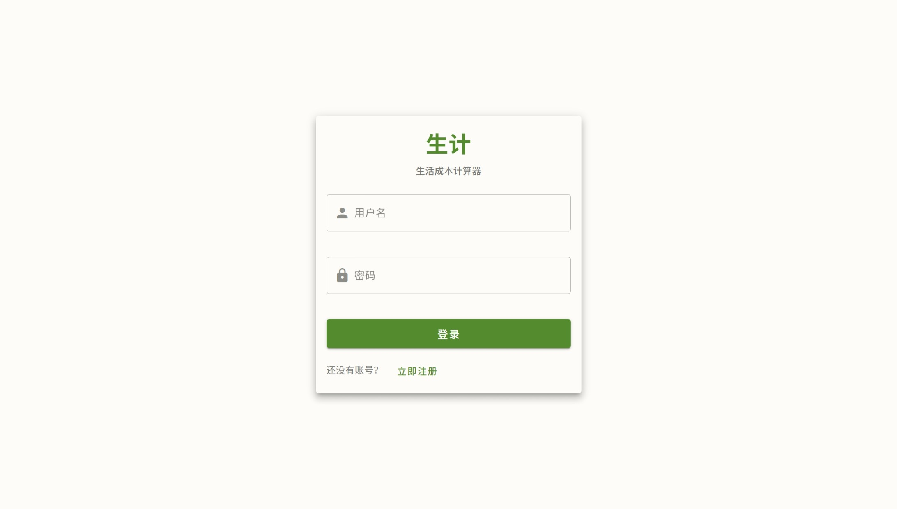
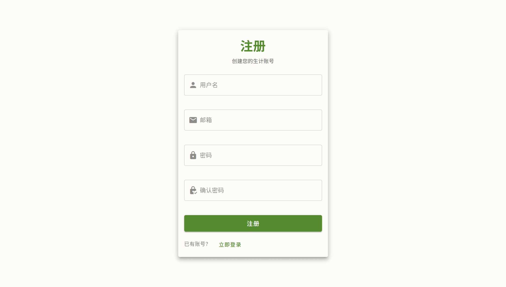
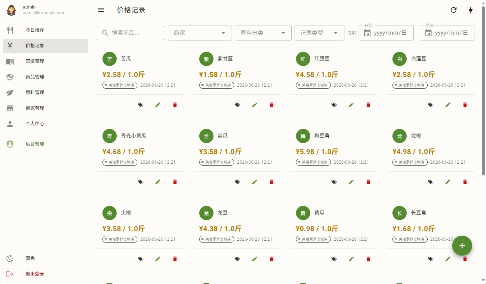

# 入门

这篇带你走完第一次使用生计的流程：注册登录、认识界面、设好单位偏好，并理解生计最特别的机制——多用户与"提议-审核"。

## 注册与登录

生计除了一般的注册方式外，也可能需要邀请码注册（由管理员控制是否开启）：

- 打开站点，进入注册页
- 若系统开启了邀请码，填入管理员发给你的邀请码
- 设置用户名、邮箱、密码（用户名 3–50 个字符，邮箱需合法格式）
- 注册成功后登录即可使用

> 忘记密码请联系管理员重置。

## 界面概览

生计是响应式设计，桌面端和移动端都能用。

- **导航栏**：每个页面顶部都有。左上角恒为**汉堡按钮**（展开/收起侧边栏），旁边第二个按钮一般是后退
- **侧边栏**：主要功能入口（价格、菜谱、原料、商品、地图、推荐、个人中心等）
- **内容区**：各功能页的主体
- **后台管理**（仅管理员可见）：邀请码、单位、地图、AI 与机翻配置、数据维护中心、Agent 任务台等入口

> 提示：系统不使用浏览器原生的弹窗（alert/confirm），所有提示都是页面内的模态框，不会漏弹。

## 单位偏好

生计支持公制、市制（斤）、英制等多种单位，且**能量有 kcal 和 kJ 两种**。第一次使用建议去**个人中心**设好偏好：

- 能量单位（kcal / kJ）
- 质量单位（默认斤）
- 体积单位

设好后，全系统的营养、价格、用量都会按你的偏好显示和换算。详见 [个人中心](profile.md)。

## 多用户与提议-审核

生计是多用户系统。理解这一点很重要，因为它决定了你"能不能直接改"。

### 数据分两类

- **你的私有数据**：你记的价格和常用地点——你直接增删改，**立即生效**。菜谱在发布前也是这个状态。
- **共享数据**：原料、商品、价格、发布后的菜谱、单位、营养、商家共享池等——所有用户共用。

### 共享数据的改法

改共享数据时，系统按你的角色分流：

| 角色 | 改共享数据 | 生效方式 |
|---|---|---|
| 普通用户 | 提交后进入**审核队列** | 管理员审核通过后生效，提交时只返回"待审核"提示 |
| 管理员 | 直接写库 | 立即生效，并留下"管理员直写"的留痕 |

所以你在功能文档里会反复看到这样的提示：

> 此项普通用户提交后进入审核队列，管理员直接生效。审核流程见 [提议审核台](admin/review.md)。

这是正常的——共享数据影响所有人，需要管理员把关。

### 你能看到什么

- 别人的私有数据你看不到
- 共享数据所有人都能看
- 价格记录去除了用户标识后跨用户公开（用于成本计算的趋势/最新价），但**看不出是谁记的**

权限细节由后方的权限框架统一管理，详见 [核心概念 · 数据归属](concepts.md#g-数据归属谁的数据归谁)。

## 下一步

读到这里，你可以开始记第一笔价格了——去 [价格记录](prices.md)。或者先了解系统怎么理解食材和价格——[核心概念](concepts.md)。
