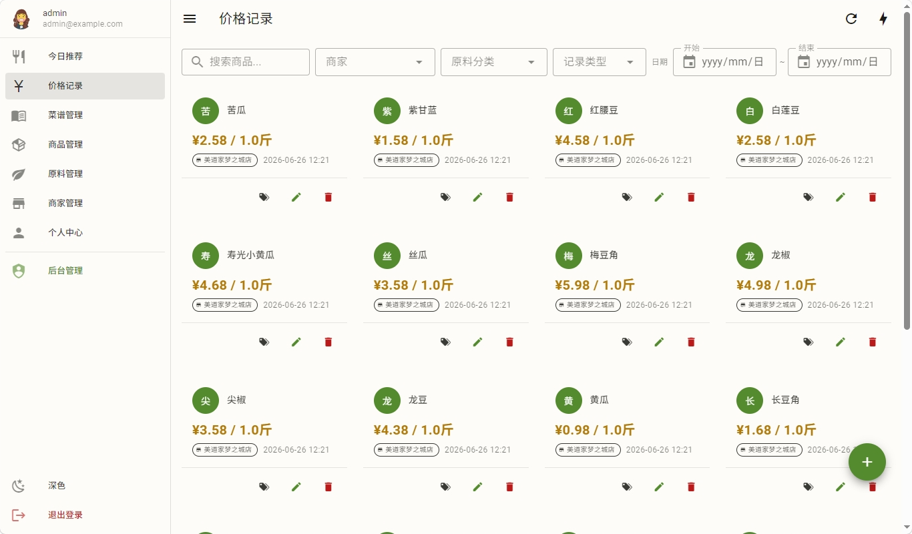
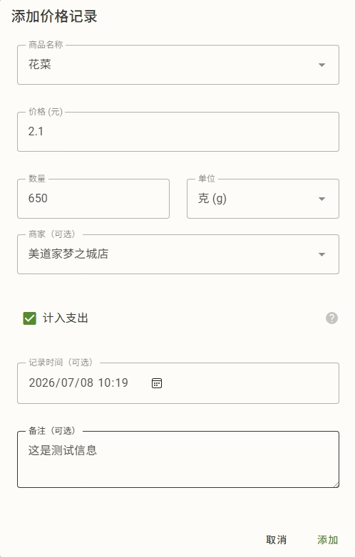
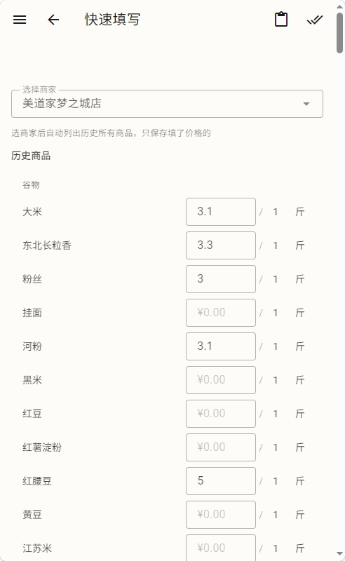
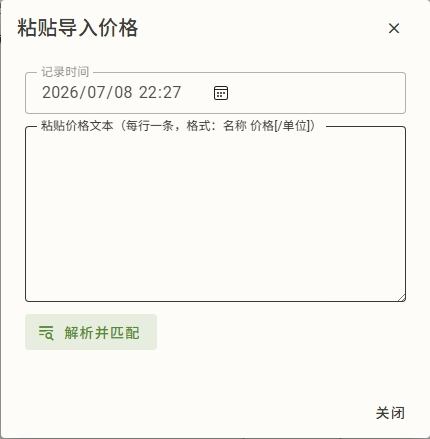

# 价格记录

记价格是生计最基础的动作——所有成本、趋势、推荐都靠它。这篇讲怎么记、怎么批量记、怎么看不重复。

如果你有足够的时间逛超市，可以把超市里面尽可能多的商品价格记下来——在系统里面记录，或者是存到备忘录里面，之后导入。

如果你没有时间，也可以根据自己购买的商品，看商品的质量、价格，来记录。系统能够自动计算单价。

## 记一笔价格

在商品详情页或价格记录页可以记一笔：

- **商品**：选已存在的商品（挂靠在某原料下）
- **金额 + 数量 + 单位**：比如 ¥15 / 10 / 个，或 ¥6 / 1 / 斤
- **商家**：选已添加的商家（可选）
- **日期**：默认今天（按你本地时区）
- **计入支出**：
  - 如果计入支出，则作为实际消费计入支出报告。通常用于根据自己购买的商品来记录价格。
  - 如果不计入支出，则该记录用于成本/趋势计算，不计入你的支出报告。通常用于通过超市的价格标签来记录价格。

记完即生效。完整的价格记录是你的**私有数据**，只有你和管理员能看到原始记录。

> 跨用户去标识公开的是"最新价/趋势"等聚合结果（看不出是谁记的），用于让所有人的成本计算更准。详见 [核心概念 · 数据归属](concepts.md#g-数据归属谁的数据归谁)。

## 快速填写

价格记录页有个"闪电"入口，进入**快速填写**页，专门对付"一次逛超市记一堆价"的场景：

1. **选商家**：进页面先选一家商家
2. **自动列历史商品**：系统按你过去记过的商品列出来（默认按拼音/字母排序，如果以前填写过价格，则按照以前填写价格时的顺序排序）
3. **逐行填价**：每行一个商品，填价格即可（数量/单位默认 1/斤，可点改）
4. **新增行**：可搜索商品加行
5. **保存**：右上角的双对勾按钮。只保存填了价格的商品

快速填写支持**移动端**优化：商品搜索下拉不会和地址栏打架、单位选择器不闪退、批量保存并发加速。

> 近 1 小时内填过的商品会按商家独立**隐藏**，避免重复记。想看全部就等会儿或换个商家。

## 粘贴导入

快速填写页还有"**粘贴导入**"（右上角的剪贴板按钮）——把一堆价直接粘进来：

支持的格式（每行一条）：

- `名称 价格` → 如 `鸡蛋 15`
- `名称 价格/单位` → 如 `鸡蛋 15/斤`
- `名称 价格/数量单位` → 如 `鸡蛋 15/10个`

粘进来后系统解析预览：

- **已匹配**：名称匹配到现有商品 → 直接导入
- **未匹配**：三种手动处理
  - 关联已有商品
  - 创建同名原料 + 商品
  - 挂靠已有原料（在该原料下新建商品）

确认后并发导入（进度 + 失败明细）。

> 别名也会参与匹配。比如你粘"青茄"，能匹配到别名是"青茄"的商品"青茄子"。

## 价格趋势

商品详情页和原料详情页都有**价格趋势**图：

- 区间：周 / 月 / 季 / 年 / **全部**（看完整历史）
- 归一化到统一单位（如 ¥/斤），跨单位可比
- 平均线受商品权重影响；最高/最低/计数不受影响（见 [核心概念 · 价格体系](concepts.md#c-价格体系)）
- 趋势是**阶梯状**的：价格变动那天才跳，没变的日子沿用前一天的价

> 大区间（季/年/全部）会自动并行加载，不用干等。

## 编辑与删除

商品详情页和原料详情页的价格记录列表，每行都能编辑或删除：

- **编辑**：改金额/数量/单位/商家
- **删除**：软删除（可恢复）

价格记录编辑删除立即生效，不需审核。

> 你删除的只是你这条记录；别人记的同商品价格不受影响。

## 审核

价格记录本身是共享的，不审核。但如果你想改的是**商品或原料**（比如商品名、原料别名、商品权重等共享数据），那部分走提议-审核。详见 [原料与商品](ingredients.md) 和 [提议审核台](admin/review.md)。
