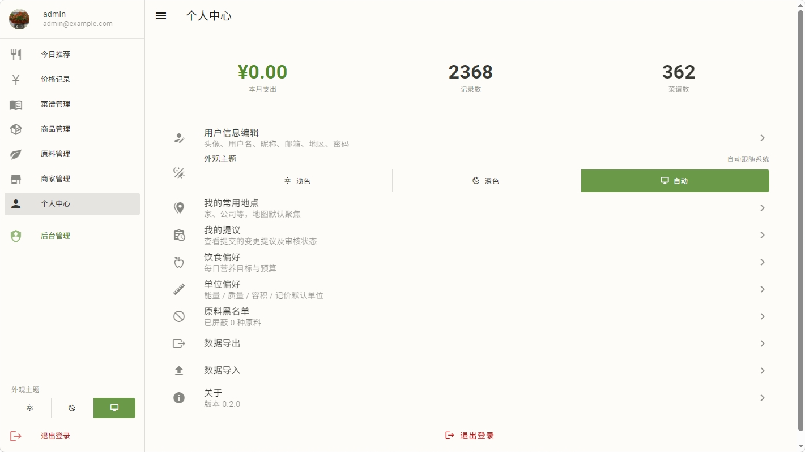
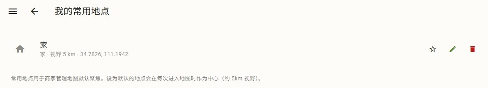
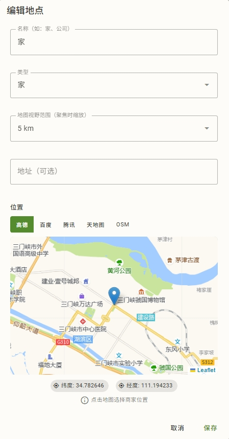
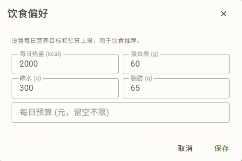
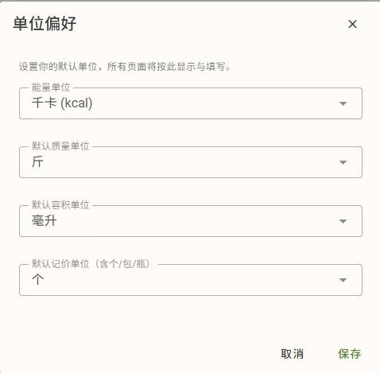
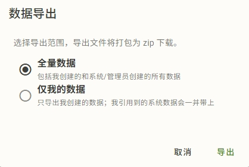

# 个人中心

个人中心管你的偏好和账户：单位、营养目标、地点、数据导出、密码。

## 我的常用地点

管理你的常用地点：

- 类型：家 / 公司 / 自定义
- 设一个**默认地点**
- 用途：商家地图默认聚焦默认地点周边（见 [商家与地图](merchants-map.md#常用地点)）

## 我的提议

## 饮食偏好

- **每日营养目标**：蛋白质、碳水、脂肪、能量等各营养素的每日目标量
- **每日预算**：每天吃饭花多少钱

这两个值是**今日推荐**的打分依据（见 [今日推荐](recommend.md)）。设得越准，推荐越贴你的需求。

> 营养目标的能量单位跟随你的能量单位偏好（kcal 或 kJ）。

## 单位偏好

生计支持多套单位体系，你的偏好设在这里。改完全系统按你的偏好换算和显示：

- **能量单位**：kcal / kJ（系数 ×4.184）
- **质量单位**：默认**斤**，可选克/千克等
- **容积单位**：毫升/升等
- **计价单位**：如果单位用的是非标准单位，则默认用什么显示

> 设好后，营养标签、价格、用量、菜谱成本都会跟着换算。原料本身不再有"默认单位"——全靠你的偏好。

## 原料黑名单

系统按 **GB 7718 的 13 类过敏原**预设了过敏原分组（含麸质、甲壳纲、鱼类、花生、大豆、奶、坚果等），每个分组映射了一批原料。

- 在过敏原管理里勾选你要避开的分组
- 推荐会**屏蔽**包含这些原料的菜谱
- 如果你后来收紧了黑名单，已有的推荐会重新过滤

## 数据导出

你可以把自己的数据导出成文件备份或迁移：

- **全量（full）**：导出系统里所有可见数据（含共享数据）
- **仅我的（mine）**：只导出你自己的数据（保证引用完整性——外键可达的都会带上）

导出内容：

- 菜谱、食材、营养、单位（HowToCook 兼容格式，含 id 扩展）
- 你的账户、交易数据（独立规格）
- 图片打包成 zip，**流式下载**

## 数据导入

## 账户安全

- **密码重置**：忘记密码请联系**管理员**，管理员在后台给你重置（输两次新密码）
- **改密码作废所有登录**：管理员给你改密码后，你之前在所有设备上的登录会**立即失效**（基于 token 版本机制），需要重新登录
- 普通字段（用户名、邮箱等）的修改不会踢你下线，只有改密码会

详见 [用户/单位/地图](admin/users-units-map.md#用户管理)。
