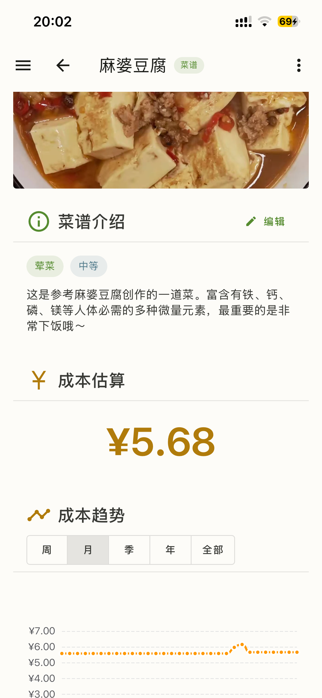
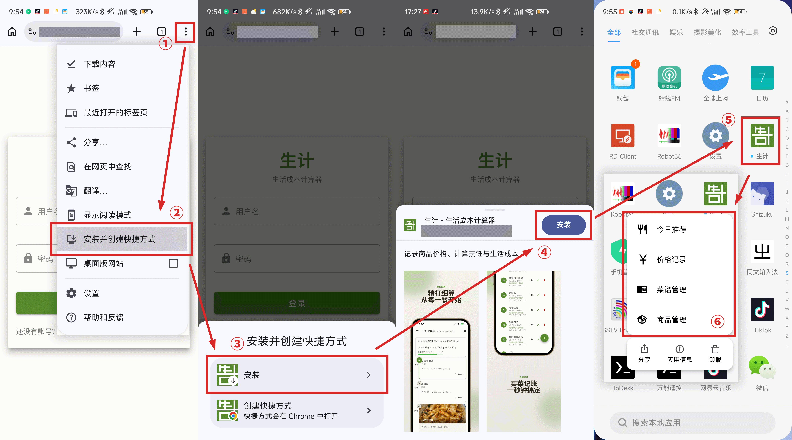
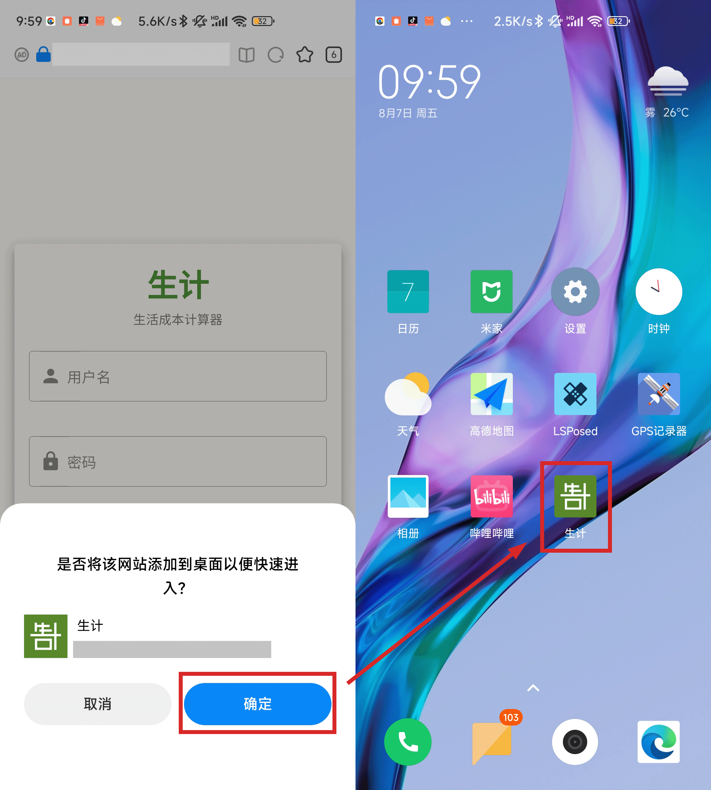
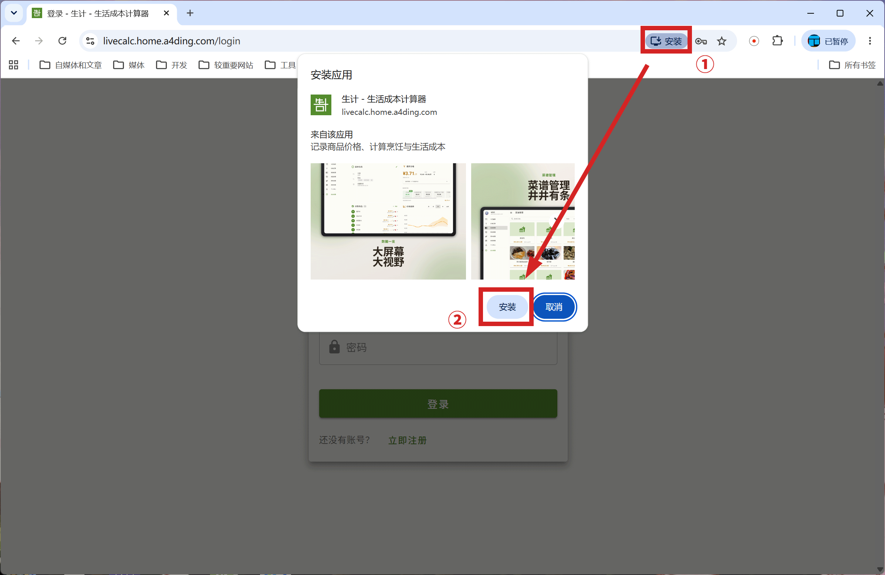
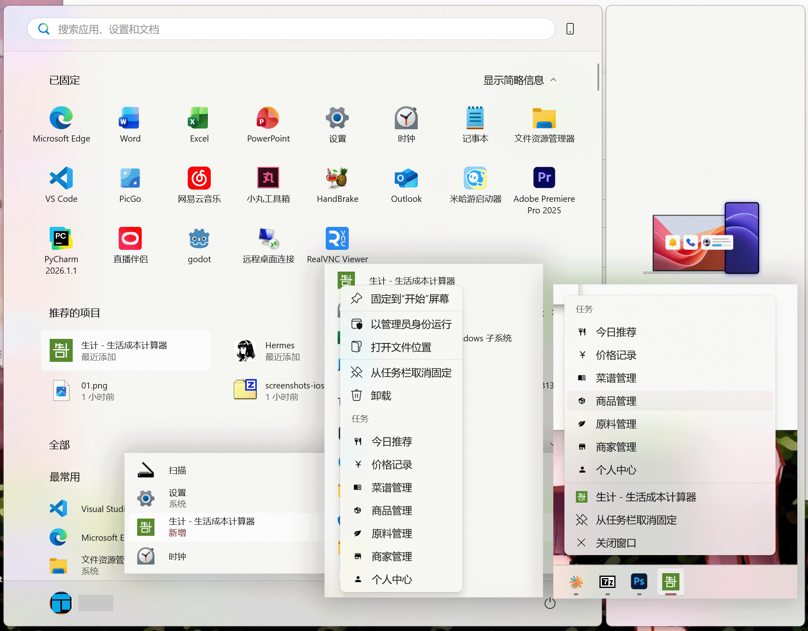

# PWA 支持

本项目支持 PWA，能够在手机 / 电脑上像普通 App 一样使用网页端。

## iOS 端的使用方式

1. 在 Safari 开启网页的主页，点击右下角的省略号
2. 点击“共享”
3. 点击“添加到主屏幕”
4. 设置主屏幕上的名称。确保“作为网页 App 打开”选项开启
5. 之后就可以在主屏幕上看到它了。你可以像普通的 App 一样使用、移动，甚至拖动到文件夹里面。

## Android 端的使用方式

推荐使用 Chrome 浏览器。

1. 在 Chrome 浏览器中打开网页，点击右上角的三个点
2. 点击“安装并创建快捷方式”
3. 在弹出的对话框中点击“安装”
4. 继续点击“安装”
5. 之后就可以在主屏幕（或者是应用列表）上看到它了，点击即可使用
6. PWA 模式下也可以使用快捷操作
   

一些浏览器在页面加载时，就会提示是否将网站添加到桌面。这也可以使用，但是视浏览器的情况，一些功能（比如说快捷操作）会无法使用。

## PC 端使用方式

以 Windows 上的 Chrome 浏览器为例：

1. 在 Chrome 浏览器中打开网页，地址栏右边会出现“安装”按钮。点击它
2. 继续点击“安装”
3. 之后就会自动打开它的 PWA 模式

同时会在桌面、开始菜单添加图标。右击可以看到、使用快捷操作。

