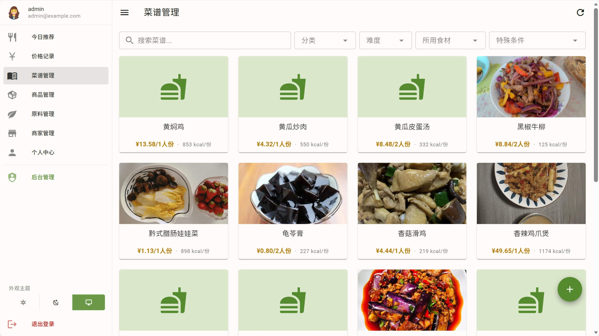
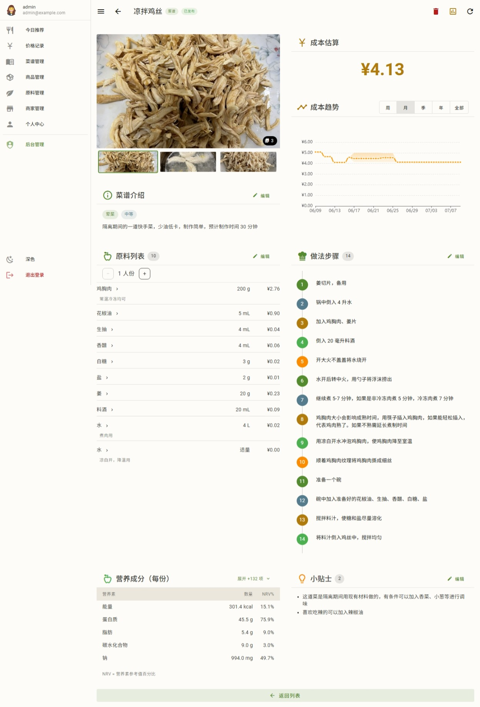
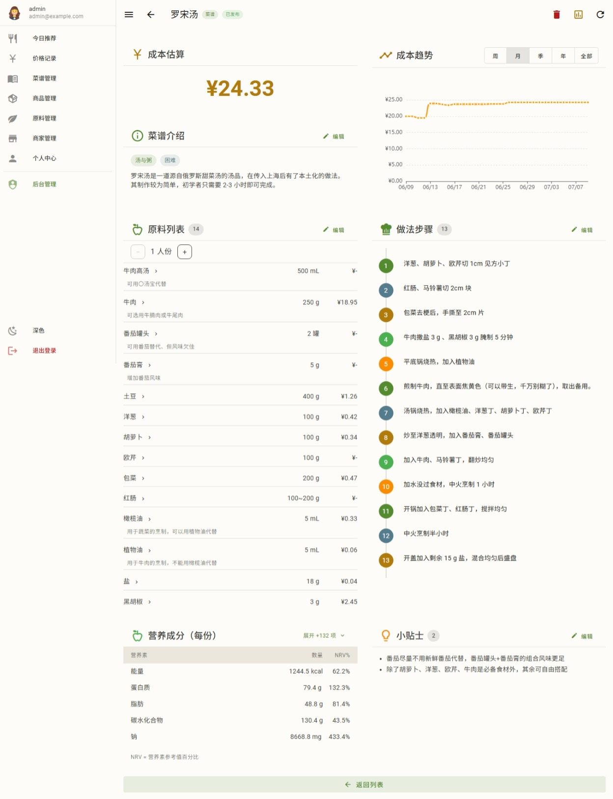
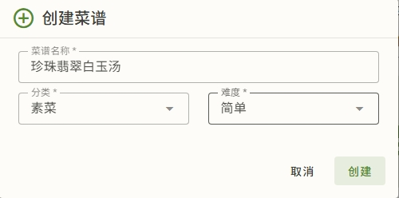
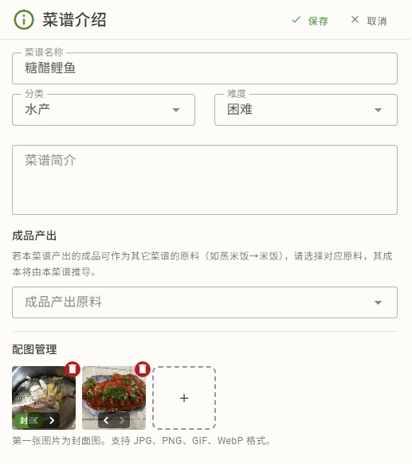
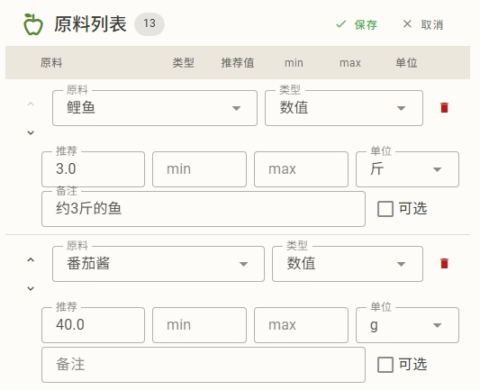
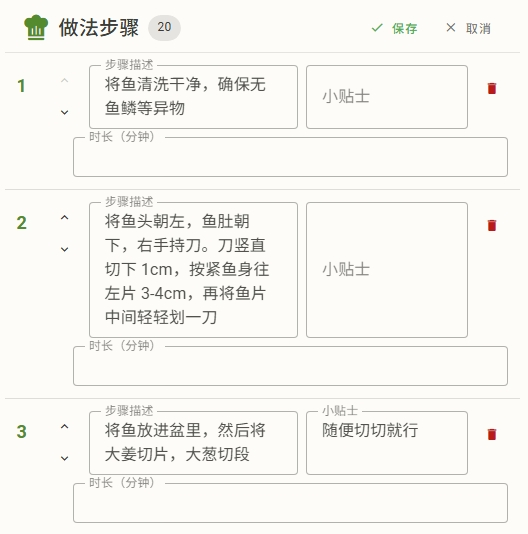
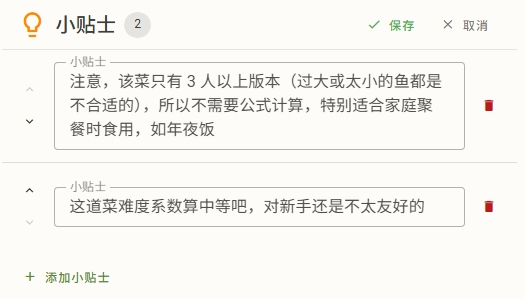

# 菜谱与成本

菜谱是生计的核心——食材用量 × 价格 = 成本，再叠上营养和趋势。这篇讲怎么用菜谱、成本怎么算。

## 浏览菜谱

菜谱列表里你能看到：

- **你创建的菜谱**：你的私有菜谱
- **公开菜谱**：别的用户公开发布的；首次启动时从 HowToCook 仓库自动导入的也属于此类

列表支持搜索（按菜谱名）、分类筛选。点进任一菜谱看详情。

## 菜谱详情

详情页分多个区块（桌面端宽屏双栏，移动端单栏）：

- **基本信息**：菜谱名、分类、份量、图片
- **食材清单**：每项是"原料 + 用量（数量/单位）"，可点开看该原料的价格/营养
- **步骤**：烹饪步骤
- **成本**：当日成本、成本区间、成本趋势
- **营养**：每份营养、NRV%

> 成本和营养数据是**异步延迟加载**的——页面先渲染基本信息，后台再算成本/营养/趋势，避免等太久。

菜谱带图片和不带图片，排版会有轻微差别。

## 创建与编辑

菜谱详情页支持**就地编辑**模式（每个区块独立编辑，不用跳页）。

创建时，可以从菜谱列表用"创建菜谱"对话框新建。

填写的是基本信息，此后进入详情页，在各个区块点击右上角的“编辑”按钮，编辑对应部分。

编辑要点：

- **菜谱介绍**：名称、分类、难度、简介、图片。如果这是个半成品菜谱（比如"蒸米饭"产出"米饭"），设"成品原料"和"产出重量"

  

- **原料列表**：搜索原料加入，设用量（数量 + 单位，或用量区间）。食材单位与计价单位不一致时系统会自动折算

  

- **做法步骤**：还可以填时长、小贴士

  

- **小贴士**

  

如果还未发布，保存即生效——此时菜谱是你的私有数据，增删改不需审核。

如果菜谱已发布，保存需要管理员审核。

## 成本计算

菜谱成本 = 各项食材"用量 × 单价"之和。要点：

- **当日成本**：取截至今天的最新价（前向填充，见 [核心概念](concepts.md#趋势的阶梯语义进阶)）
- **用量是区间**时取平均值
- **单位不一致**时按实体单位覆盖或密度折算（见 [单位与密度](units-density.md)）
- **半成品菜谱**的成本逐层传递（见下）
- 成本明细会列出**哪些商品参与了加权**

成本数值随你记的新价格变化——你今天记了鸡蛋涨价，菜谱成本趋势的今天就会跳。

## 成本趋势

菜谱详情有**成本趋势**图，区间 周/月/季/年/全部：

- 按日聚合，阶梯状（价格变了才跳）
- 大区间（季/年/全部）会**并行加载**，不用逐批等
- 按你本地日归日（见 [核心概念 · 一天](concepts.md#d-时间与一天的口径)）

## 半成品菜谱

原料可以指向它的"制作菜谱"（带产出重量）。当原料没有商品价时，系统会由制作菜谱的成本反推它的每克单价。

例子：原料"米饭"没有商品价，但菜谱"电饭煲蒸米饭"把它当成品、产出 1500 克。于是"米饭"的每克价 = "蒸米饭"菜谱成本 ÷ 1500。

支持**递归套娃**（菜谱的原料又指向另一个半成品），并自动**检测循环**（A 引用 B、B 又引用 A 时不会死循环）。

详见 [核心概念 · 半成品菜谱](concepts.md#半成品菜谱)。

## 发布菜谱

菜谱可以设为"公开"（`is_public`）。公开后别的用户能在列表看到、用得到。你的私有菜谱别人看不到。

> 管理员创建菜谱默认公开发布；普通用户菜谱默认私有，可手动公开。

## 审核

发布前的菜谱本身是你的私有数据，增删改直接生效、不需审核。但是发布之后，所有用户都可以修改，只有管理员可以删除。详见 [提议审核台](admin/review.md)。
