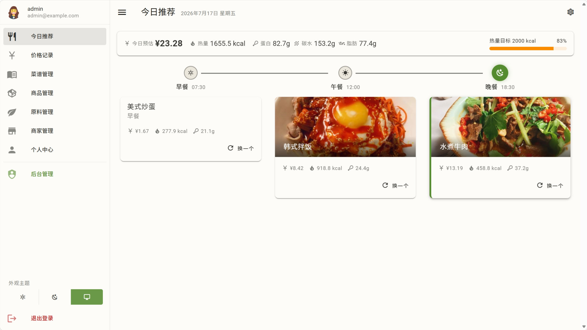

# 今日推荐

生计能根据你的营养目标和预算，每天给你推荐三餐。这篇讲推荐怎么来、怎么换、怎么避过敏原。

## 三餐推荐

打开"今日推荐"页，系统会为你的**早 / 午 / 晚**各选一道菜。选菜的依据是：

- 你的**营养目标**（蛋白质、碳水、脂肪、能量等）
- 你的**预算**
- **黑名单 / 过敏原**（屏蔽某些原料）

## 生成机制

- **首次访问触发后台生成**：不阻塞响应，先返回"生成中"，前端轮询直到就绪
- **打分**：按"营养接近目标 + 成本接近预算 + 不含黑名单"给候选菜谱打分
- **加权随机选取**：不是死板地取最高分（那样天天同一道），而是按分数加权随机——高分大概率选中、低分也有微小机会，**每天有变化**

这样既保证推荐质量，又不会每天看到一模一样的三道菜。

## 换一个

每餐可以点"**换一个**"，系统重新选一道（自动排除当前这道，保证换出不同菜）。

- 每餐每天有刷新次数限制（默认 5 次）
- 超出后提示"明天再来"

## 黑名单 / 过敏原

你在 [个人中心 · 原料黑名单](profile.md#原料黑名单) 设的黑名单原料，会从候选菜谱池里排除——含黑名单原料的菜谱不会被推荐给你。过敏原分组由管理员维护（见 [后台管理 · 原料黑名单分组](admin/admin-pages.md#原料黑名单分组)），你可以在个人中心整组加入黑名单。

如果所有候选菜谱都命中黑名单，会提示你调整黑名单范围。

## 当天缓存与"今天"

- 当天已生成的推荐会**缓存**，不会每次刷新都重算
- "今天"按你的**本地日**界定（见 [核心概念 · 一天](concepts.md#d-时间与一天的口径)）——你在东八区的"今天"和在美国的"今天"不一样，系统按你本地算
- 跨过本地午夜后自动进入第二天，重新生成
- 想立即换当餐就点"换一个"

## 生成不出推荐？

- **候选菜谱池为空**：菜谱太少，多加几个菜谱
- **所有候选都命中黑名单**：提示你调整黑名单范围
- **营养目标/预算未设**：去 [个人中心](profile.md) 设一下
